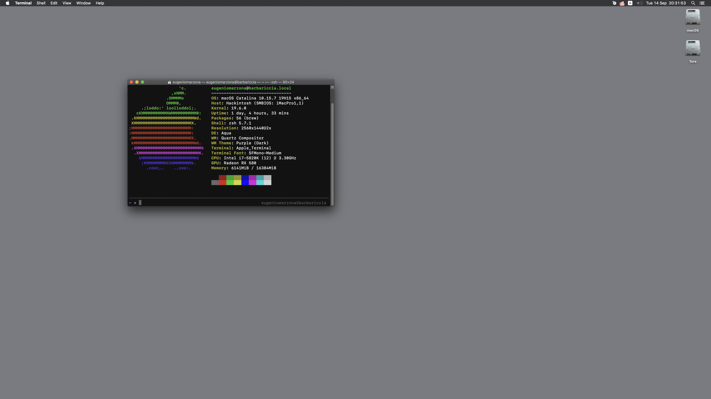

# OpenCore Msi X99A Sli Plus
This repository contains an OpenCore EFI directory properly configured for this board (Msi X99A Sli Plus).

Some info about fixes and specific steps to setup a complete build is presented in the next passages. Note that this is a WIP, some things are still untested and some functionality might be broken.

## My Specs

* _**Mobo**_: Msi X99A Sli Plus
* _**CPU**_: i7 5820K @stock clocks
* _**GPU**_: Radeon RX 580 (Polaris)
* _**HDD Setup**_: Sata-3 SSDs. NVME is currently untested
* _**Wi-Fi/Bluetooth**_: None/Untested
* _**OpenCore Version**_: 0.6.1 (Debug)
* _**macOS Version**_: Catalina 10.15.7

**Note:** This should work for other MSI X99 Boards but you might need to rewrite the SSDTs used.

## Pre-Install Setup steps
### 1. Bios config and update
Make sure you are running the latest BIOS, you can find the latest update file [here](https://www.msi.com/Motherboard/support/X99A-SLI-PLUS.html#down-bios).

For reference, I'm running the bios version **7885v1F2**.

Now, set your BIOS settings as below, if not told otherwise, keep defaults:
* Settings > Advanced > PCI Subsystem Settings
  * **Above 4G Decoding:** Enabled
* Settings > Advanced > Integrated Peripherals
  * **SATA Mode:** AHCI
  * **sSATA Mode:** AHCI
  * **HPET:** Enabled
* Settings > Advanced > USB Configuration
  * **USB Controller:** Enabled
  * **XHCI Hand-off:** Enabled
  * **EHCI Hand-off:** Enabled
  * **Legacy USB Support:** Enabled
* Settings > Advanced > Windows OS Configuration
  * **Windows 10 Support:** Enabled
  * **MSI Fast Boot:** Disabled
  * **Fast Boot:** Disabled
  * **Secure Boot:** Disabled
* Overclocking > CPU Features
  * **Intel Virtualization Tech:** Enabled
  * **Inted VT-D:** Enabled
  * **CFG Lock:** Disabled

### 2. Plist config
If you are using a Broadwell-E CPU, you'll need to change the spoofed CPU-ID (Under **Kernel > Emulate**).
* Broadwell E:
  * Cpuid1Data: D4060300 00000000 00000000 00000000
  * Cpuid1Mask: FFFFFFFF 00000000 00000000 00000000

Remember also to setup a valid Serial and Board number (using iMacPro1,1 SMBios), more info [here](https://dortania.github.io/OpenCore-Install-Guide/config-HEDT/broadwell-e.html#platforminfo).

If you are using a **Navi** GPU, remember to add to boot-args
* **agdpmod=pikera**

Other settings, should be fine.

### 3. Kexts
The EFI folder in this repo includes pre-configured SSDTs and kexts for my specific config (i7 5820k). If you are using any other processor and/or OC Settings, you'll need to:
1. Set a proper core number for **TSCAdjustReset.kext**.
2. Remove (or disable in config.plist) **CPUFriend.kext** and **CPUFriendDataProvider.kext**. These are not needed to install macOS and you'll need to generate them again on your own build, see Post-install notes for more info.

### 4. Setup Memory whitelist (IMPORTANT)
This motherboard has a very quirky memory layout, the only way to get consistent boots is to use **DevirtualiseMmio** and a memory whitelist.

The config.plist provided has a whitelist configured for my own system and might not work for you. Fear not because setting up a memory whitelist is pretty simple, make sure you are running the debug version of OpenCore and follow this [guide](https://dortania.github.io/OpenCore-Install-Guide/extras/kaslr-fix.html#using-devirtualisemmio).

## Post Install
Ok, you should now have a working macOS install, however there are still a couple of things to fix
1. To get proper **power management**, regenerate **CPUFriend.kext** and **CPUFriendDataProvider.kext** and add them to your EFI folder, info (here)[https://dortania.github.io/OpenCore-Post-Install/universal/pm.html#using-cpu-friend].
2. X99 does not support native **NVRAM**, to fix, follow this (guide)[https://dortania.github.io/OpenCore-Post-Install/misc/nvram.html].
3. If you need **iServices**, see (here)[https://dortania.github.io/OpenCore-Post-Install/universal/iservices.html].
4. To get proper **sleep and wake**, you'll need to set up your own USB Map. The EFI provided includes a working **USBMap.kext** and SSDTs definition for all USB controllers on the motherboard. However, if you are using any of the internal 2.0 or 3.0 usb headers, you'll have to regenerate it. This can be done automatically using CorpNewt's [USBMap](https://github.com/corpnewt/USBMap), just remember to delete the included **USBMap.kext** and disable the XHCI port limit in your config.plist before running the tool.