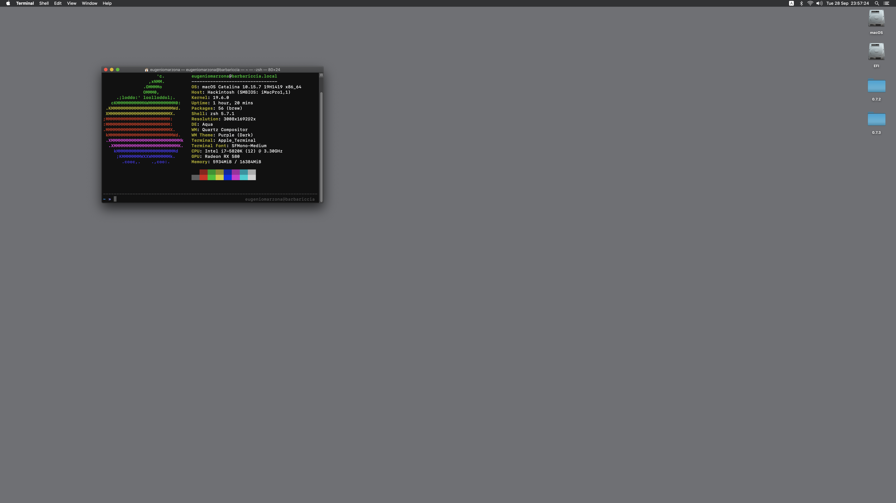

# OpenCore Msi X99A Sli Plus
This repository contains an OpenCore EFI directory properly configured for this board (Msi X99A Sli Plus).

Some info about fixes and specific steps to setup a complete build is presented in the next passages. Note that this is a WIP, some things are still untested and some functionality might be broken.

## My Specs

* _**Mobo**_: Msi X99A Sli Plus
* _**CPU**_: i7-5820K
* _**GPU**_: Radeon RX 580 (Polaris)
* _**HDD Setup**_: Crucial P2 - NVME M.2
* _**Wi-Fi/Bluetooth**_: Dell DW-1820A + NGFF to PCI-x1 adapter
* _**OpenCore Version**_: 0.7.2 Debug
* _**macOS Version**_: Catalina 10.15.7

**Known Issues:** Sidecar does not work (requires intel iGPU) | VIA VL805 USB controller has no macOS compatible driver | Opencore 0.7.3 breaks compatibility with the current config.plist

**BigSur & Later Support:** Untested - should work with a properly configured USBMap.

## Pre-Install Setup steps
### 1. Bios config
Make sure you are running the latest BIOS, you can find the latest update file [here](https://www.msi.com/Motherboard/support/X99A-SLI-PLUS.html#down-bios).
For reference, I'm running the bios version **7885v1E** ( audio injection via AppleALC _DOES NOT WORK_ on **7885v1F2** ).

Now, set your BIOS settings as below, if not told otherwise, keep defaults:
* Settings > Advanced > PCI Subsystem Settings
  * **Above 4G Decoding:** Enabled
* Settings > Advanced > Integrated Peripherals
  * **SATA Mode:** AHCI
  * **sSATA Mode:** AHCI
  * **HPET:** Enabled
* Settings > Advanced > USB Configuration
  * **USB Controller:** Enabled
  * **XHCI Hand-off:** Enabled
  * **EHCI Hand-off:** Enabled
  * **Legacy USB Support:** Enabled
* Settings > Advanced > Windows OS Configuration
  * **Windows 10 Support:** Enabled
  * **MSI Fast Boot:** Disabled
  * **Fast Boot:** Disabled
  * **Secure Boot:** Disabled
* Overclocking > CPU Features
  * **Intel Virtualization Tech:** Enabled
  * **Inted VT-D:** Disabled
  * **CFG Lock:** Disabled

And this is the settings list I'm using with my NVME drive (note that this will disable on-board sata ports); leave defaults if you're using sata-drives:

### 2. Plist config
If you are using a Broadwell-E CPU, you'll need to change the spoofed CPU-ID (Under **Kernel > Emulate**).
* Broadwell E:
  * Cpuid1Data: D4060300 00000000 00000000 00000000
  * Cpuid1Mask: FFFFFFFF 00000000 00000000 00000000

Remember also to setup a valid Serial and Board number (using iMacPro1,1 SMBios), more info [here](https://dortania.github.io/OpenCore-Install-Guide/config-HEDT/broadwell-e.html#platforminfo).

If you are using a **Navi** GPU, remember to add to boot-args
* **agdpmod=pikera**

**Section _DeviceProperties > Add_**
* remove the *PciRoot(0x0)/Pci(0x1,0x1)/Pci(0x0,0x0)* entry if you are not using an M.2 SSD
* remove the *PciRoot(0x0)/Pci(0x1C,0x7)/Pci(0x0,0x0)* entry if you wifi card is not a Dell DW-1820

### 3. Kexts
The EFI folder in this repo includes pre-configured SSDTs and kexts for my specific config (i7 5820k). If you are using any other processor and/or OC Settings, you'll need to:
1. Set a proper core number for **TSCAdjustReset.kext** (if your cpu threads number is != 12).
2. Remove (or disable in config.plist) **CPUFriend.kext** and **CPUFriendDataProvider.kext**. These are not needed to install macOS and you'll need to generate them again on your own build, see Post-install notes for more info.
3. If your wifi card is natively supported / you have no wifi card, you can remove **AirportBrcmFixup.kext**, **BrcmPatchRAM3.kext**, **BrcmFirmwareData.kext** and **BrcmBluetoothInjector.kext** from the kext directory.
4. Use the **USBPorts.kext** included in **./USB-back-io-only/USBPorts.kext** to install macOS (this map includes only the back-io usb ports, see post-install notes for more info)

### 4. Setup Memory whitelist (IMPORTANT)
This motherboard has a very quirky memory layout, the only way to get consistent boots is to use **DevirtualiseMmio** and a memory whitelist.

The config.plist provided has a whitelist configured for my own system and might not work for you. Fear not because setting up a memory whitelist is pretty simple, make sure you are running the debug version of OpenCore and follow this [guide](https://dortania.github.io/OpenCore-Install-Guide/extras/kaslr-fix.html#using-devirtualisemmio).

## Post Install
Ok, you should now have a working macOS install, however there are still a couple of things to fix
1. To get proper **power management**, regenerate **CPUFriend.kext** and **CPUFriendDataProvider.kext** and add them to your EFI folder, info [here](https://dortania.github.io/OpenCore-Post-Install/universal/pm.html#using-cpu-friend).
2. X99 does not support native **NVRAM**, to fix, follow this [guide](https://dortania.github.io/OpenCore-Post-Install/misc/nvram.html).
3. If you need **iServices**, see [here](https://dortania.github.io/OpenCore-Post-Install/universal/iservices.html).

### USB Mapping
This board has multiple USB controllers, but only the native intel ones (XHCI, EH01, EH02) have ACPI entries.

The VIA VL805 and the ASMedia controller have no ACPI definitions and should not be mapped; these are treated by the OS as external pci controllers.
This diagram should help you identify usb ports on the motherboard's back io.

#### How to configure your own USBMap
1. Remove **USBPorts.kext** from your kext directory
2. Open-up your config.plist and enable **Kernel > Quirks > XhciPortLimit**
3. Reboot and use SSDTTime or Hackintool to map usb ports (more info [here](https://dortania.github.io/OpenCore-Post-Install/usb/intel-mapping/intel.html)). Map only the usb ports connected to the intel native controllers (XHCI, EH01, EH02)
4. Add the generated **USBMap.kext** to your kext directory
5. Disable **Kernel > Quirks > XhciPortLimit**

#### About Third party USB Controllers
The VIA usb controller has no macOS compatible driver. I've added the controller's vendor id to **XHCI-Unsupported.kext** and this should load **AppleUSBXHCIPCI** for this controller.

This is not a great solution but it works (more or less ...).